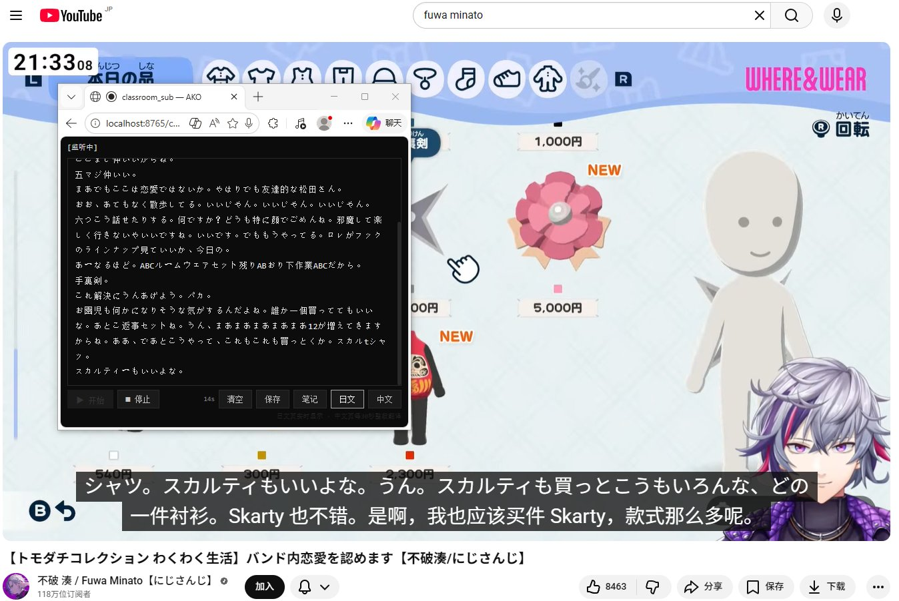
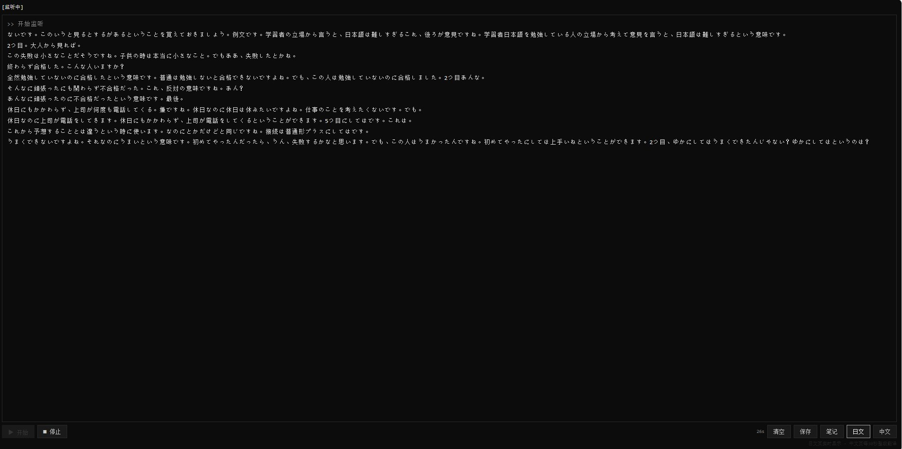
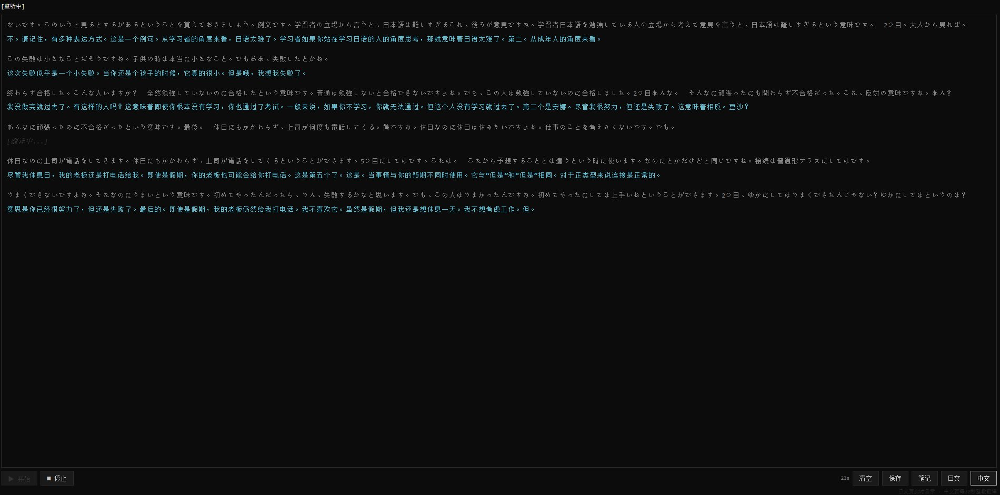
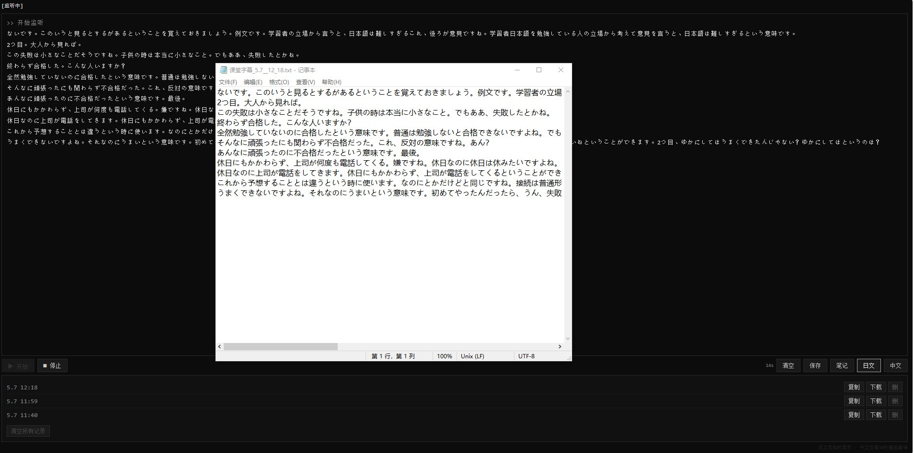

# classAko

**留学生課堂日译中实时字幕工具 / 留学生のための日中リアルタイム字幕ツール**

[▼ 立即使用 / 今すぐ使う](https://memeku9.github.io/classAko/)

---

 
实测：识别 Vtuber 直播音频（不破湊／にじさんじ）

---

## 中文 ｜ [日本語](#ja)

### 这是什么

classAko 是一个**留学生上日语课用的浏览器字幕工具**。打开网页 → 点开始 → 老师讲日语，实时滚动日文识别，每 30 秒整段翻译成中文。下课后可以直接保存成笔记 txt。

完全在浏览器里跑，**不用安装任何软件**，开源免费。

### 适用场景

- 在日本上日语课、专业课，老师讲得快跟不上
- 想快速整理课堂笔记，不想边听边手写
- 想用日语视频/直播练听力，需要双语对照
- 网课、会议、讲座的日中翻译参考

### 怎么用

1. 用 **Edge 或 Chrome** 浏览器访问 [memeku9.github.io/classAko](https://memeku9.github.io/classAko/)
2. 第一次会弹麦克风权限，点**允许**
3. 点 ▶ **开始** —— 老师讲话，日文实时滚动
4. 切换到 **中文** 页 —— 每 30 秒整段中文翻译
5. 下课点 **保存** —— 进 **笔记** 面板下载 txt

<table>
<tr>
<td width="50%"></td>
<td width="50%"></td>
</tr>
<tr>
<td align="center">日文页·实时滚动</td>
<td align="center">中文页·30秒整段翻译</td>
</tr>
</table>

### 关于音频源

- ✔ **接收外部声音**（笔记本麦克风录到的老师声音）
- ✔ **接收电脑播放的声音**（网课、视频）
- ✘  **电脑静音播放时无法识别**——必须实际有声音输出
- ♬ **课堂场景建议**：接一个**微型领夹麦克风**贴近老师方向，收音质量大幅提升

### 笔记导出

每次保存的内容都存在浏览器本地，**不上传任何服务器**。可以随时复制、下载 txt 或删除。文件名带日期时间戳，方便归档。

### 设备支持

| 设备 | 浏览器 | 支持情况 |
|---|---|---|
| Windows 电脑 | Edge / Chrome |  流畅 |
| Mac 电脑 | Chrome / Edge |  流畅 |
| Mac 电脑 | Safari |  能用但不稳定 |
| Android 手机 | Chrome | 能用，UI 未为手机优化 |
| iPhone / iPad | 任意浏览器 |  Apple 限制，不支持 |

### 注意

这个工具基于浏览器自带的 Web Speech API，**会有漏字、识别错字、翻译不准的情况**。

- **适合有一定日语基础的同学**作为听课辅助参考
- **不适合完全零基础**靠它当同传
- **请勿与商业产品（讯飞听见、有道、Otter 等）对标**本工具是个人独立开发的免费小工具

### 隐私

- 麦克风音频由 Edge / Chrome 浏览器自带的语音服务处理（微软/谷歌）
- 翻译走谷歌翻译免费接口
- 笔记保存在你浏览器的本地存储里，不上传任何地方
- 整个项目零后端、零数据库

### 协议

GPL-3.0，详见 [LICENSE](LICENSE)。

简单说：自由使用、自由修改、自由分发，但**改造后的版本必须也开源**。

### 关于作者

由 **MEMEKU9（メメク）** 开发，是 [AKOMUN 项目]的一部分。

---

## 日本語 ｜ [中文](#zh)

### これは何？

classAko は、**日本で授業を受ける留学生のためのブラウザ字幕ツール**です。Webページを開いて「開始」ボタンを押すだけで、先生の日本語をにリアルタイム表示、30秒ごとの中国語訳をまとめて表示します。授業後にテキストファイルとしてノート保存も可能。

完全にブラウザ上で動作し、**インストール不要**、オープンソース・無料です。

### 使用シーン

- 日本での授業や講義で、先生のスピードについていけないとき
- 板書ではなく、授業メモを自動で整理したいとき
- 日本語の動画・配信でリスニング練習、対訳が欲しいとき
- オンライン授業・会議・講演の翻訳参考に

### 使い方

1. **Edge または Chrome** ブラウザで [memeku9.github.io/classAko](https://memeku9.github.io/classAko/) を開く
2. 初回はマイク許可ダイアログが出るので**許可**を押す
3. ▶ **開始** ボタンを押す ── 日本語がリアルタイム表示
4. **中文** タブに切り替え ── 30秒ごとに中国語訳がまとめて表示
5. 授業後、**保存** を押す ── **笔记**（ノート）パネルからtxtダウンロード可能

### 音声入力について

- ✔ **外部音声**（ノートPCのマイクが拾った先生の声）に対応
- ✔ **PC再生音**（オンライン授業、動画）に対応
- ✘  **PCがミュート状態の場合は認識不可** ── 実際に音声出力が必要です
- ♬ **教室で使う場合のおすすめ**：**小型ピンマイク**を先生の方向に向けると認識精度が大幅向上

### 対応デバイス

| デバイス | ブラウザ | 対応状況 |
|---|---|---|
| Windows PC | Edge / Chrome |  完全対応 |
| Mac | Chrome / Edge | 完全対応 |
| Mac | Safari |  動くが不安定 |
| Android | Chrome |  動くが、UIはPC最適化 |
| iPhone / iPad | 全ブラウザ |  Apple制限により非対応 |

### 正直なところ

このツールはブラウザ標準の Web Speech API ベースで動作しており、**文字落ち・誤認識・翻訳ミスは発生します**。

- **ある程度日本語の基礎がある方**の授業補助としてご利用ください
- **完全初心者の同時通訳代わり**にはなりません
- **商業製品（Otterなど）との比較は控えてください** ── あちらは専門チームと専用モデル、本ツールは個人開発の無料ツールです

### プライバシー

- マイク音声は Edge / Chrome 内蔵の音声認識サービス（Microsoft / Google）が処理
- 翻訳は Google 翻訳の無料APIを利用
- ノートはブラウザのローカルストレージに保存、外部送信なし
- バックエンド・データベースは一切なし

### ライセンス

GPL-3.0、詳細は [LICENSE](LICENSE) を参照。

要約：自由に使用・改変・配布可能、ただし**改変版もオープンソースとして公開する義務**があります。

### 作者について

**MEMEKU9（メメク）** が個人開発。[AKOMUN プロジェクト]の一部です。

---

Made with  by メメク · Dedicated to international students in Japan

